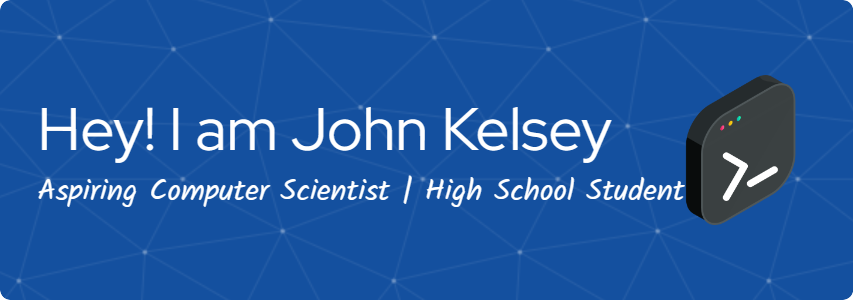

I'm a developer on a quest to conquer the wild world of code. Python's my current go-to, but I'm also dipping my toes in HTML, CSS, and JS. Downloaded PostgreSQL, but it's currently chilling on my desktop like a shy roommate. I even decided to learn C# because why not, right? Currently building my future with SvelteKit (a super cool front-end framework) and Firebase as my backend.
Also learning [Ethical Hacking](https://skillsforall.com/) and [Microsoft Azure](https://learn.microsoft.com/en-us/training/)

Check out my blog(at [Substack](https://substack.com/@johnkelsey) or [Hashnode](https://hashnode.com/@johnkelsey)) for the full epic saga (and maybe some embarrassing coding faux pas)!

Reach me through [Email](johnkelsey.irungu@gmail.com)

If you'd like to support me and my work feel free to send a [tip](https://buymeacoffee.com/johnkelsey)

<h3 align="left">Connect with me:</h3>

<h3 align="left">Languages and Tools:</h3>

                </a>     

<!---
john-kelsey/john-kelsey is a ✨ special ✨ repository because its `README.md` (this file) appears on your GitHub profile.
You can click the Preview link to take a look at your changes.
--->
